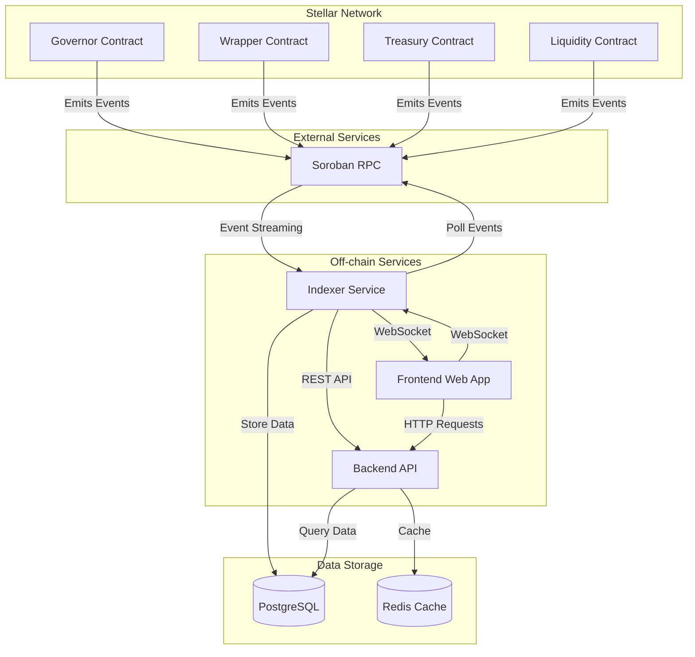
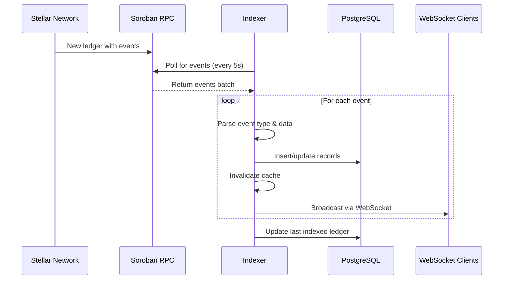
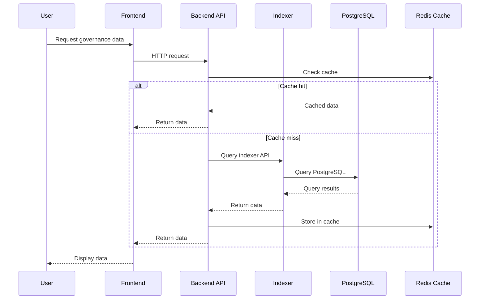
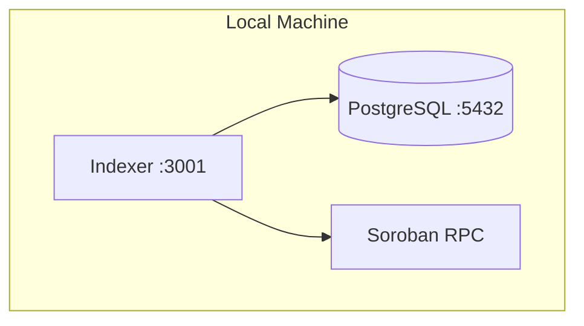
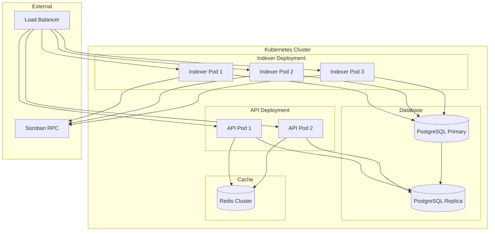

# NebGov System Architecture

This document describes the high-level architecture of the NebGov governance system, including all components and their interactions.

## System Overview

NebGov is a decentralized governance platform built on Stellar that enables on-chain proposal creation, voting, and execution. The system consists of smart contracts deployed on the Stellar network and off-chain services that index and analyze governance data.

## Architecture Diagram

## Components

### Stellar Smart Contracts

#### Governor Contract
The core governance contract that manages:
- Proposal creation and validation
- Voting mechanism (for, against, abstain)
- Proposal execution
- Configuration management
- Delegation system

**Key Events:**

- `ProposalCreated`: New proposal submitted
- `VoteCast` / `VoteCastWithReason`: Vote recorded
- `ProposalQueued`: Proposal queued for execution
- `ProposalExecuted`: Proposal executed successfully
- `ProposalCancelled`: Proposal cancelled
- `DelegateChanged`: Voting delegation updated
- `ConfigUpdated`: Governance parameters changed
- `GovernorUpgraded`: Contract upgraded

#### Wrapper Contract
Token wrapper that enables governance participation:
- Token deposits and withdrawals
- Delegation via wrapper
- Voting power calculation

**Key Events:**
- `Deposit`: Tokens deposited
- `Withdraw`: Tokens withdrawn
- `DelegateChanged`: Delegation updated

#### Treasury Contract
Manages treasury funds and batch transfers:
- Multi-recipient transfers
- Token management
- Approval workflows

**Key Events:**
- `BatchTransfer`: Batch transfer executed

#### Liquidity Contract
Provides liquidity pool functionality:
- Liquidity provision
- Token swapping
- Fee management

**Key Events:**
- `LiquidityAdded`: Liquidity provided
- `LiquidityRemoved`: Liquidity removed
- `Swap`: Token swap executed
- `PoolFeeUpdated`: Fee updated

### Indexer Service

The indexer service (`packages/indexer/`) is responsible for:
- **Event Streaming**: Continuously polls the Stellar Soroban RPC for new governance events
- **Data Storage**: Processes and stores events in PostgreSQL
- **Real-time Notifications**: Broadcasts events via WebSocket to connected clients
- **API Endpoints**: Provides REST API for querying governance data

**Key Components:**
- **Event Processor** (`src/events.ts`): Fetches and processes events from Stellar RPC
- **REST API Server** (`src/api.ts`): Express server with HTTP endpoints
- **WebSocket Server** (`src/ws.ts`): Real-time event broadcasting
- **Cache Layer** (`src/cache.ts`): In-memory caching for performance
- **Database Layer** (`src/db.ts`): PostgreSQL connection and migrations

**Configuration:**
- Polls Stellar RPC every 5 seconds (configurable via `POLL_INTERVAL_MS`)
- Tracks last indexed ledger for resumption
- Supports multiple contract addresses (governor, wrapper, treasury, liquidity)

**API Endpoints:**
- `GET /health`: Health check and indexing progress
- `GET /stats`: Aggregate governance statistics
- `GET /proposals`: List proposals with pagination
- `GET /proposals/:id`: Single proposal details
- `GET /proposals/:id/votes`: Proposal votes
- `GET /delegates`: Delegation leaderboard
- `GET /profile/:address`: Address governance profile
- `GET /wrapper/deposits`: Wrapper deposit history
- `GET /wrapper/withdrawals`: Wrapper withdrawal history
- `GET /treasury/transfers`: Treasury transfer history
- `GET /config-history`: Configuration change history
- `GET /upgrade-history`: Governor upgrade history
- `GET /leaderboard/voters`: Voter participation leaderboard

**WebSocket Events:**
- Real-time broadcasts for all governance events
- Client-side filtering by event type or proposal ID
- Subscription-based model

See [packages/indexer/README.md](../packages/indexer/README.md) for detailed indexer documentation.

### Backend API

The backend API serves as the primary interface for the frontend application:
- Aggregates data from the indexer
- Implements business logic
- Handles authentication and authorization
- Provides optimized queries for frontend use

### Frontend Web App

The web application provides user interface for:
- Viewing proposals and voting
- Managing delegations
- Analyzing governance data
- Real-time updates via WebSocket

### Data Storage

#### PostgreSQL
Primary database for indexed governance data:
- Proposals and votes
- Delegation history
- Configuration changes
- Treasury transfers
- Indexer state

#### Redis Cache
Caching layer for frequently accessed data:
- Proposal lists
- Vote tallies
- Statistics
- Profile data

### External Services

#### Soroban RPC
Stellar network RPC endpoint:
- Provides access to ledger data
- Event streaming
- Contract state queries

## Data Flow

### Event Indexing Flow

### User Query Flow

## Deployment Architecture

### Development Environment

### Production Environment

## Security Considerations

### Indexer Security
- Rate limiting on API endpoints (100 req/15min general, 30 req/15min sensitive)
- Input validation on all API endpoints
- PostgreSQL connection pooling
- Environment variable-based configuration
- Non-root user in Docker containers

### Smart Contract Security
- Guardian address for emergency operations
- Time-locked proposal execution
- Quorum requirements for proposals
- Vote weight validation

## Monitoring and Observability

### Health Checks
- Indexer `/health` endpoint provides:
  - Ledger lag metrics
  - Indexed counts
  - Service uptime
  - Status (ok/degraded)

### Logging
- Event processing logs
- Error tracking
- Performance metrics
- Database query logs

### Metrics
- Request latency
- Event processing rate
- Database query performance
- Cache hit rates

## Scalability

### Horizontal Scaling
- Indexer: Can run multiple instances (only one should index to avoid duplication)
- API: Stateless, can scale horizontally
- Database: Read replicas for query scaling

### Vertical Scaling
- Increase PostgreSQL resources for larger datasets
- Increase cache size for better hit rates
- Adjust poll interval based on network activity

## Disaster Recovery

### Database Backups
- Regular PostgreSQL backups
- Point-in-time recovery capability
- Backup replication to separate region

### Indexer Recovery
- Indexer state stored in `indexer_state` table
- Automatic resumption from last indexed ledger
- No data loss on restart

## Future Enhancements

### Planned Features
- Multi-chain support
- Advanced analytics and reporting
- Mobile application
- Governance notifications
- Proposal templates

### Architecture Improvements
- Event streaming via WebSocket instead of polling
- GraphQL API for flexible queries
- Message queue for event processing
- Distributed tracing for observability
